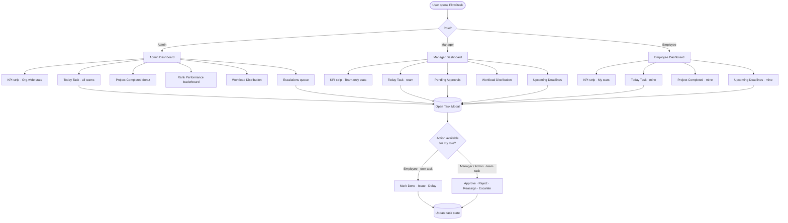
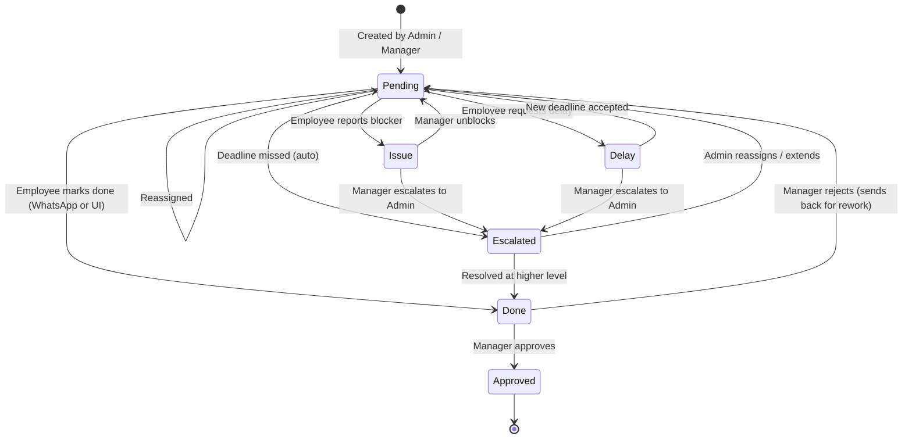
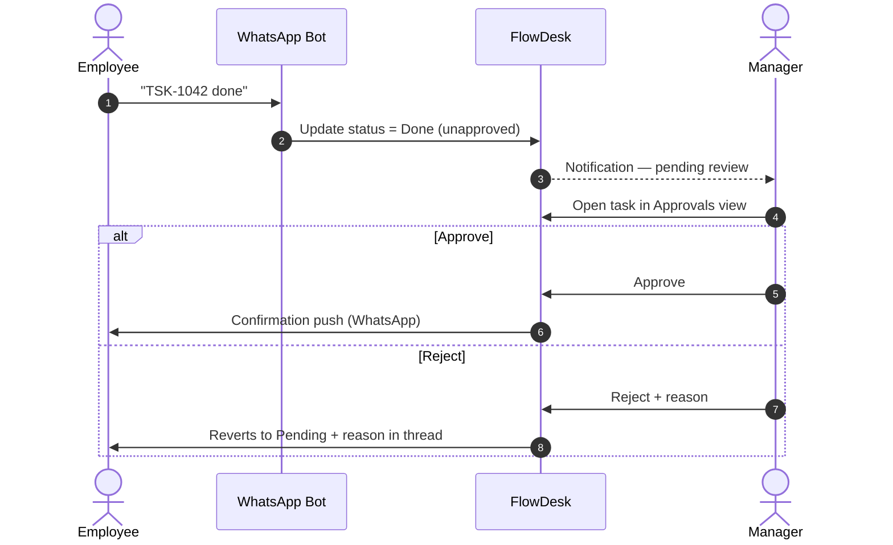
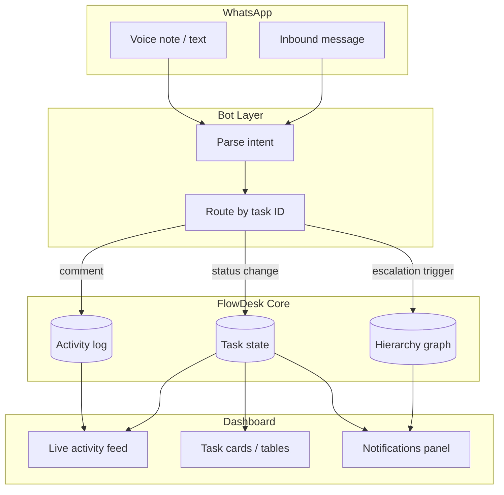
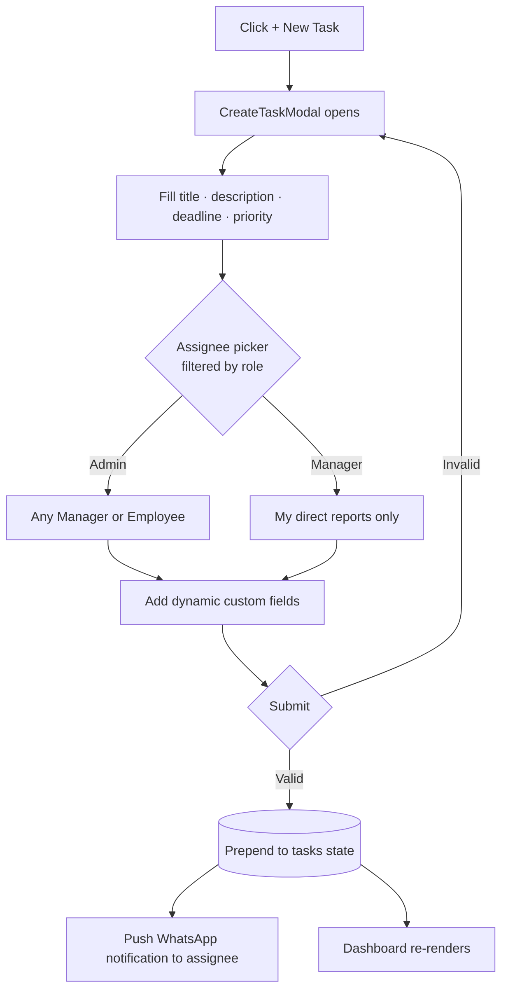
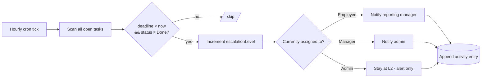

# FlowDesk — Application Flowcharts

Visual reference for how the WhatsApp-driven task manager works.
All diagrams use [Mermaid](https://mermaid.js.org) and render natively
on GitHub, in VS Code (with the Markdown Preview Mermaid Support extension),
and on most static-doc renderers.

---

## 1. High-level user flow (role-aware)



---

## 2. Task lifecycle (state machine)



---

## 3. Escalation flow (hierarchy bubbling)

```mermaid
flowchart LR
    E[Employee task] -- deadline missed --> Auto{{Auto-escalate L0 → L1}}
    Auto --> M[Reporting Manager]
    M -- still blocked --> Manual{{Manual escalate L1 → L2}}
    Manual --> A[Admin]
    A -- resolves / reassigns --> Resolved([Resolved])

    classDef level0 fill:#dde6f9,stroke:#0284c7,color:#0f172a;
    classDef level1 fill:#fad6c4,stroke:#ea580c,color:#0f172a;
    classDef level2 fill:#f7d8e2,stroke:#be123c,color:#0f172a;

    class E level0
    class M level1
    class A level2
```



---

## 4. Approval flow (Manager review loop)



---

## 5. WhatsApp ↔ FlowDesk integration



---

## 6. Component / data architecture (frontend)

```mermaid
flowchart LR
    subgraph Data[Mock data layer]
        Users[(users[])]
        Tasks[(tasks[])]
        Notifs[(notifications[])]
    end

    subgraph Context[AppContext.jsx]
        Provider[useApp - role · theme · tasks · search · CRUD ops]
    end

    Data --> Provider

    subgraph Shell[App.jsx]
        TopNav
        ProjectHeader
        Router{active view}
    end

    Provider --> Shell

    Router --> Admin[AdminDashboard]
    Router --> Manager[ManagerDashboard]
    Router --> Employee[EmployeeDashboard]
    Router --> Tasks2[TasksView]
    Router --> Team[TeamView]
    Router --> Approvals[ApprovalsView]
    Router --> Esc[EscalationsView]
    Router --> WA[WhatsAppHub]
    Router --> Analytics[AnalyticsView]

    subgraph Cards[Reusable cards]
        KPI[KPIStrip]
        Today[TodayTaskBoard]
        Donut[ProjectCompletedCard]
        Rank[RankPerformanceCard]
        Tracker[TrackerDetailCard]
        Chat[ChatCard]
        Deadlines[UpcomingDeadlinesCard]
        Workload[WorkloadCard]
    end

    Admin --> Cards
    Manager --> Cards
    Employee --> Cards

    subgraph Modals[Overlays]
        TDM[TaskDetailsModal]
        CTM[CreateTaskModal]
        Notif2[NotificationsPanel]
    end

    Cards -. open .-> TDM
    ProjectHeader -. + New Task .-> CTM
    TopNav -. bell .-> Notif2
```

---

## 7. Create-task flow (Admin / Manager)



---

## 8. Auto-escalation cron (conceptual)



---

### Where each diagram lives in the code

| Diagram | Source of truth |
|---|---|
| Role-based view routing | [`src/App.jsx`](src/App.jsx) `renderView()` |
| Task state mutations | [`src/context/AppContext.jsx`](src/context/AppContext.jsx) — `setTaskStatus`, `approveTask`, `rejectTask`, `escalateTask`, `reassignTask` |
| Escalation level math | [`src/data/mockData.js`](src/data/mockData.js) — `isOverdue`, task `escalationLevel` |
| Approval queue | [`src/views/ApprovalsView.jsx`](src/views/ApprovalsView.jsx) |
| Hierarchy lookup | `directReports(managerId)` in [mockData.js](src/data/mockData.js) |

> All "WhatsApp" interactions are simulated via UI buttons + activity-log entries
> in this demo. The diagrams above describe the intended production behavior
> when the bot integration is wired in.
